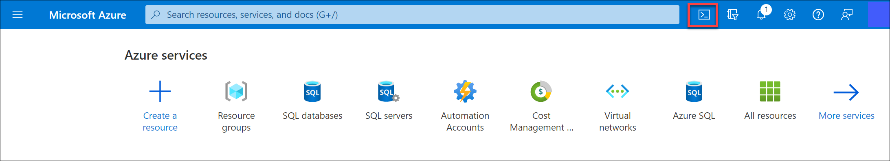
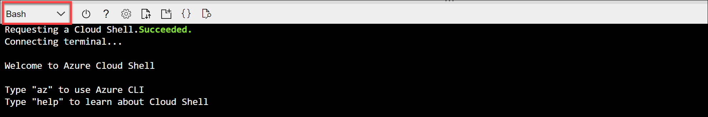
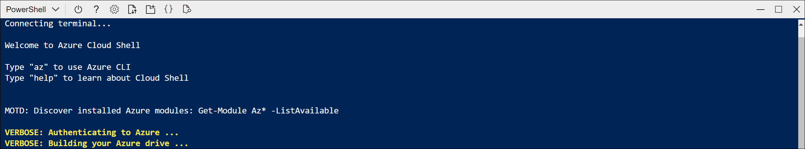
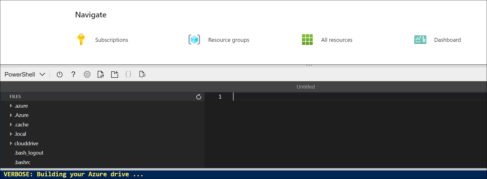

# Explore speech

To build software that can interpret audible speech and respond appropriately, you can use the **Speech** cognitive service, which provides a simple way to transcribe spoken language into text and vice-versa.

For example, suppose you want to create a smart device that can respond verbally to spoken questions, such as "What time is it?" The response should be the local time.

To test the capabilities of the Speech service, we'll use a simple command-line application that runs in the Cloud Shell. The same principles and functionality apply in real-world solutions, such as web sites or phone apps.

## Create a **Cognitive Services** resource

You can use the Speech service by creating either a **Speech** resource or a **Cognitive Services** resource.

If you haven't already done so, create a **Cognitive Services** resource in your Azure subscription.

1. In another browser tab, open the Azure portal at [https://portal.azure.com](https://portal.azure.com?azure-portal=true), signing in with your Microsoft account.

1. Click the **&#65291;Create a resource** button, search for *Cognitive Services*, and create a **Cognitive Services** resource with the following settings:
    - **Subscription**: *Your Azure subscription*.
    - **Resource group**: **AI-900-Module-04a-<inject key="DeploymentID" enableCopy="false"/>**.
    - **Region**: *Select the same region where your resource group was created*.
    - **Name**: enter **ai900cognitive-<inject key="DeploymentID" enableCopy="false"/>**.
    - **Pricing tier**: Standard S0.
    - **By checking this box I acknowledge that I have read and understood all the terms below**: Selected.

1. Review and create the resource.

### Get the Key and Location for your Cognitive Services resource

1. Wait for deployment to complete. Then go to your Cognitive Services resource, and on the **Overview** page, click the link to manage the keys for the service. You will need the endpoint and keys to connect to your Cognitive Services resource from client applications.

1. View the **Keys and Endpoint** page for your resource. You will need the **location/region** and **key** to connect from client applications.

## Run Cloud Shell

To test the capabilities of the Speech service, we'll use a simple command-line application that runs in the Cloud Shell on Azure.

1. In the Azure portal, select the **[>_]** (*Cloud Shell*) button at the top of the page to the right of the search box. This opens a Cloud Shell pane at the bottom of the portal.

    

1. The first time you open the Cloud Shell, you may be prompted to choose the type of shell you want to use (*Bash* or *PowerShell*). Select **PowerShell**. If you do not see this option, skip the step.  

1. If you are prompted to create storage for your Cloud Shell, ensure your subscription is selected and click on **Show advanced settings**. Please make sure you have selected your resource group AI-900-Module-04a-<inject key="DeploymentID" enableCopy="false"/> and enter **blob<inject key="DeploymentID" enableCopy="false"/>** for the **Storage account** and enter **blobfileshare<inject key="DeploymentID" enableCopy="false"/>** for the  **File share** , then click on **Create Storage**.
    
    
   
1. Make sure the the type of shell indicated on the top left of the Cloud Shell pane is switched to *PowerShell*. If it is *Bash*, switch to *PowerShell* by using the drop-down menu.

    

1. Wait for PowerShell to start. You should see the following screen in the Azure portal:  

    

## Configure and run a client application

Now that you have a custom model, you can run a simple client application that uses the Speech service.

1. In the command shell, enter the following command to download the sample application and save it to a folder called ai-900.

    ```PowerShell
    git clone https://github.com/MicrosoftLearning/AI-900-AIFundamentals ai-900
    ```


1. The files are downloaded to a folder named **ai-900**. Now we want to see all of the files in your Cloud Shell storage and work with them. Type the following command into the shell:

     ```PowerShell
    code .
    ```

    Notice how this opens up an editor like the one in the image below:

    

1. In the **Files** pane on the left, expand **ai-900** and select **speaking-clock.ps1**. This file contains some code that uses the Speech service to recognize and synthesize speech:

    

1. Don't worry too much about the details of the code, the important thing is that it needs the region/location and either of the keys for your Cognitive Services resource. Copy these from the **Keys and Endpoints** page for your resource from the Azure portal and paste them into the code editor, replacing the **YOUR_KEY** and **YOUR_LOCATION**  placeholder values respectively.

    > **Tip**
    > You may need to use the separator bar to adjust the screen area as you work with the **Keys and Endpoint** and **Editor** panes.

    After pasting the key and region/location values, the first lines of code should look similar to this:

    ```PowerShell
    $key = "1a2b3c4d5e6f7g8h9i0j...."
    $region="somelocation"
    ```
    
    >**Note:**
    >Region should be written in small letters, for example : eastus2

1. After making the changes to the variables in the code, press **CTRL+S** to save the file. Then press **CTRL+Q** to close the code editor.

    The sample client application will use your Speech service to transcribe spoken input and synthesize an appropriate spoken response. A real application would accept the input from a microphone and send the response to a speaker, but in this simple example, we'll use pre-recorded input in a file and save the response as another file.

    Use the video player below to hear the input audio the application will process:

    <div class="embeddedvideo"><iframe src="https://www.microsoft.com/videoplayer/embed/RWMAvi" frameborder="0" allowfullscreen="true" data-linktype="external"></iframe></div>

1. In the PowerShell pane, enter the following command to run the code:

    ```PowerShell
    cd ai-900
    ./speaking-clock.ps1
    ```

1. Review the output, which should have successfully recognized the text "What time is it?" and saved an appropriate response in a file named *output.wav*.

    Use the following video player to hear the spoken output generated by the application:

    <div class="embeddedvideo"><iframe src="https://www.microsoft.com/videoplayer/embed/RWMSIU" frameborder="0" allowfullscreen="true" data-linktype="external"></iframe></div>

## Learn more

This simple app shows only some of the capabilities of the Speech service. To learn more about what you can do with this service, see the [Speech page](https://azure.microsoft.com/services/cognitive-services/speech-services/).
